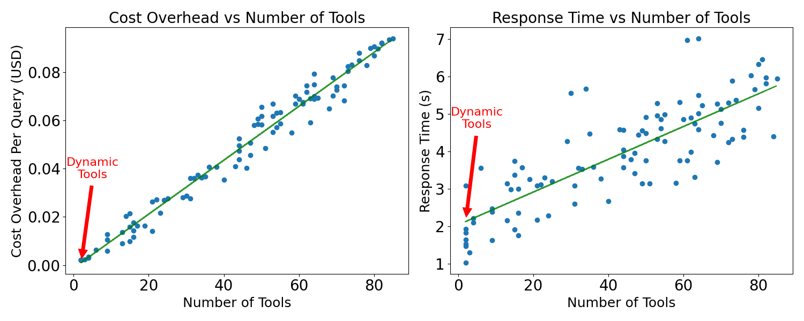

# LLM Tool Call Cost Benchmark

This repository contains a benchmarking to measure the token usage and response time impact of passing different numbers of tools to a large language model.

## Purpose

When working with LLMs that support function/tool calling, there's a tradeoff between:
- Providing more tools (giving the model more capabilities)
- Increasing token usage (which affects cost and latency)

This benchmark quantifies that relationship by measuring:
1. Cost overhead vs. number of tools provided
2. Response time vs. number of tools provided

## Results



## Running the Benchmark

Set up your API keys using `.env.example` as example.

To run the benchmark:

```bash
uv run main.py
```

The script will:
1. Fetch all available toolkits from UnifAI
2. For each benchmark run:
   - Randomly select n toolkits (where n ranges from 1 to the total number)
   - Get the tools from these toolkits
   - Make a LLM call with these static tools
   - Record token usage and response time
3. Save results to `benchmark_results.jsonl`
4. Plot the results with linear regression

After running the benchmark, you'll get:
- A scatter plot showing cost overhead vs. number of tools
- A scatter plot showing response time vs. number of tools
- Linear regression lines for both relationships
- The plots will be saved as `benchmark_results.png`

Results are accumulated across runs in the `benchmark_results.jsonl` file, so you can run the script multiple times to gather more data points.
